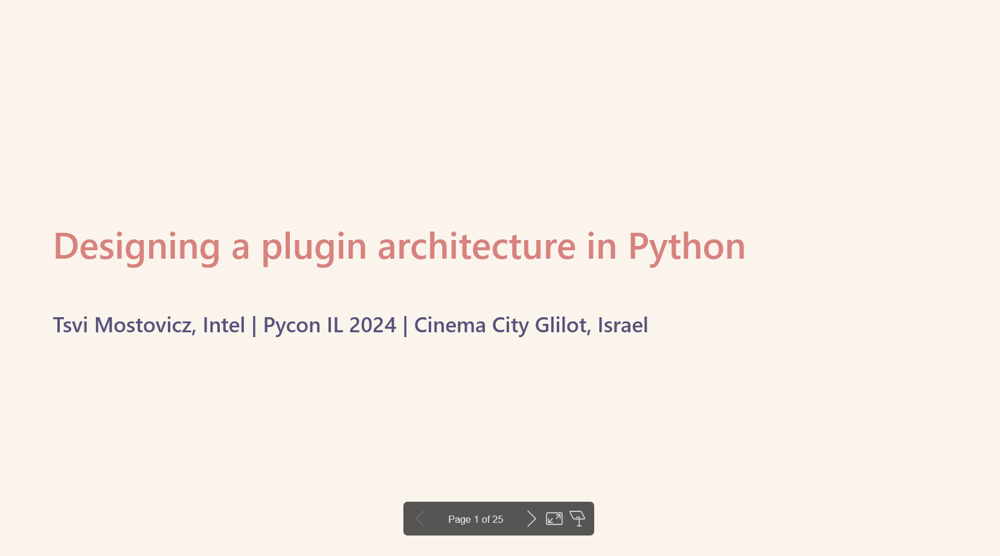

# PyCon Talks

This repository contains materials for my PyCon talks, including slides, code examples, and additional resources.

## Talks

### [Designing a Plugin Architecture in Python](./designing-a-plugin-architecture/)

**Presented at:** PyCon IL 2024

**Abstract:** Discover how to enhance your Python apps with plugin architectures using importlib.

This talk explores how to design and implement flexible and extensible plugin architectures in Python applications. Learn strategies for dynamic imports, entry points, registration systems, and performance optimizations.

**Resources:**

- Full slide set 

- Youtube video 

### [Beyond Constants: Mastering Python Enums](./mastering-enums/)

**Scheduled for:** PyCon IL 2025

**Abstract:** Explore advanced enum usage in Python: define methods, attach metadata, and create enums dynamically. Learn the benefits and pitfalls of the enum singleton to write more expressive and maintainable code.

This upcoming talk will share powerful techniques for using Python enums beyond simple constants, including adding extra data and methods to make code more expressive and dynamically generating enums from configuration files.