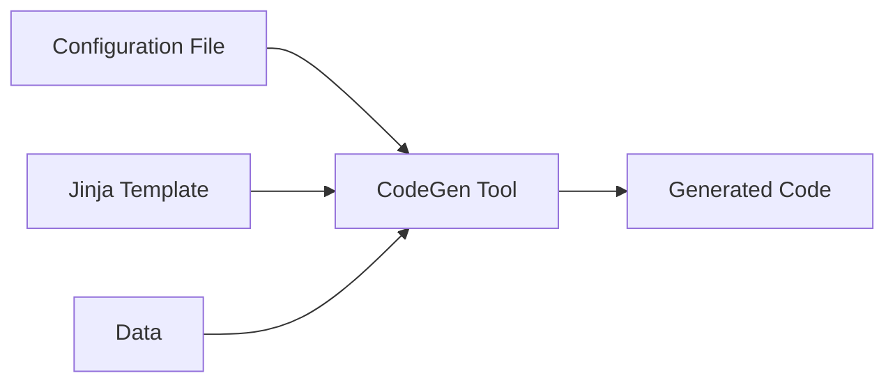

# Designing a plugin architecture in Python

Tsvi Mostovicz | Pycon IL 2024 | Cinema City Glilot, Israel

---

<!-- 2 min - A story describing what a plugin architecture solves -->

## Intro

<!-- TODO: Add images -->

* You write a Python app supporting a variety of options
* A user asks for their specific-use case ...
* Another user asks for their specific-use case ...
* A third user asks for their specific-use case ...
* You realize that slowly your app is becoming a kitchensink

---

<!-- 2 min - Who am I, what I do, a bit about Intel -->

# Bio

---

<!-- 3 min

Step-by-step introduce the example tool for our talk using a block diagram.
The tool (a code generator) takes a configuration file, a Jinja template, and data and generates code by applying the template to the data.

(Explain 30 seconds on Jinja)

Our plugin architecture will focus on two points that should be highlighted by the end of the slide:
    - Using user-defined Jinja filters
    - Support new data sources

Show the graph step by step.
- Step 1: CodeGen Tool
- Step 2: Inputs
- Step 3: Output
- Step 4: Highlight the arrow going from the tool to the output
- Step 5: Highlight the data block
-->

# A Real-Life Example


---

<!-- 
3 min
Explain what plugins need to be supported.
 - Discovery - can be automatic or manual
    - Automatic - search for pre-defined directories/names
    - Manual - provided by a configuration
 - Loading and Registration
    - We need the application to understand what can be called
    - In our example:
        - Jinja must be aware of the available filters
        - When trying to parse a data source we need to know that a parser is available
-->

# Supporting plugins

* Discovery
    - Automatic
    - Manual (provided by configuration)
* Loading and Registration

---

<!-- 3 min

Example of registering / loading a Jinja filter

-->

# A simple dynamic import

```python
from importlib import util

def get_filters(filter_file: Path) -> dict[str, Callable[..., Any]]:
    """Function that returns a dictionary of dynamically loaded filters."""
    spec = util.spec_from_file_location(filter_file.stem, filter_file)
    if not spec:
        sys.exit(-1)
    if not spec.loader:
        sys.exit(-1)
    filter_module = util.module_from_spec(spec)
    spec.loader.exec_module(filter_module)
    members: dict[str, Callable[..., Any]] = dict(getmembers(filter_module, isfunction))
    if "__filters__" in dir(filter_module):
        members = {
            name: func
            for name, func in members.items()
            if name in filter_module.__filters__
        }
    return members

def setup_template_env(template_dir: Path, filter_file: Path):
    template_env = jinja2.Environment(loader=jinja2.FileSystemLoader(template_dir))
    template_env.filters.update(BUILTIN_FILTERS)
    template_env.filters.update(get_filters(filter_file))
```

--- 

<!--

- Explain why we need the dunder variable (allow for testing)
- DO NOT DISCUSS 3rd-party unless asked about

-->

# Adding a Jinja filter

```python
__filters__ = ["respond_to"]


def respond_to(name, my_name):
    """Greet and introduce yourself."""
    return f"Hello to you {name}! My name is {my_name}."

if __name__ == "__main__":
    print(respond_to("test", "foo"))
```

```jinja
{{ "Jack" | respond_to("John") }}
```

---

<!--
Entry points - 4 min

Entry points have multiple usages:
 - CLI/GUI scripts
 - Plugins
-->


# Supporting new data-sources using entry points

```python
import sys
from importlib.metadata import entry_points

discovered_parsers = entry_points(group='codegen.parsers')
    
def get_parser(data_file: Path) -> Callable:
    parser = BUILTIN_PARSER.get(data_file.suffix)
    if parser:
        return parser
    parser_ep = discovered_parsers.get(name=data_file.suffix) 
    if parser_ep:
        return parser_ep.load()

def parse_data(data_file: Path) -> dict[str, Any]:
    parse = get_parser(data_file)
    parse(data_file)
```

Other ways exist to create these types of plugins. [See here][other-ways]

---

# Adding a data parser

```toml
[project.entry-points.'codegen.parsers']
yaml_parser = "codegen.parsers:parse_yaml"
```

```python
import yaml

def parse_yaml(path: Path) -> dict[str, Any]:
    return yaml.safe_load(path.read_text())
```

---

# Recap

<!--

- Why do we want plugins?
- What do we need to define a plugin?
- How can we support plugins?

-->

* Why?
* What?
* How?

---

# Footnotes

Links to resources:

- [other-ways]: https://packaging.python.org/en/latest/guides/creating-and-discovering-plugins/