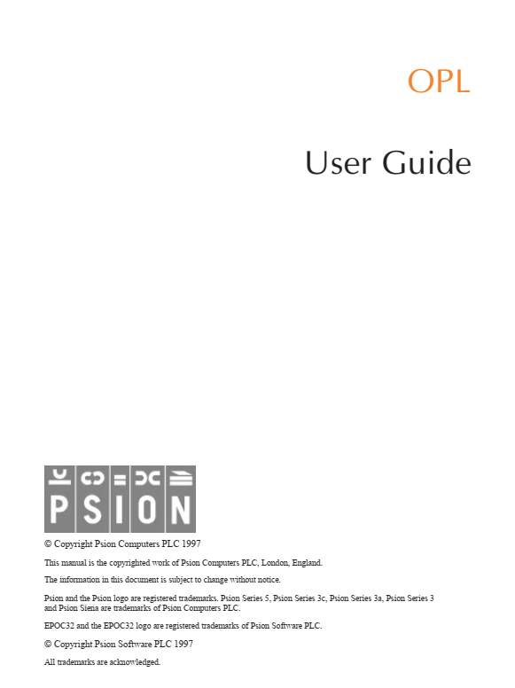

---

marp: true
theme: pycon-talk-theme
title: Designing a plugin architecture in Python

---

# Designing a plugin architecture in Python

Tsvi Mostovicz | Pycon IL 2024 | Cinema City Glilot, Israel

---

<!-- 2 min - Who am I, what I do, a bit about Intel -->

# Bio

---

<div style="display: flex; justify-content: space-between; align-items: center; margin-bottom: 20px;">
<div data-marpit-fragment="1">


</div>
<div data-marpit-fragment="2">


</div>
</div>

<div style="display: flex; justify-content: space-between; align-items: center; margin-bottom: 20px;">
<div data-marpit-fragment="3">

 
</div>
<div data-marpit-fragment="4">


</div>
</div>

---

- Maintainer of Home Assistant Jewish calendar integration
  <span style="display: flex; align-items: center; justify-content: flex-start">
 
 
 </span>
</div>

<div data-marpit-fragment="4">

- Pre-Silicon Validation (aka Verification/DV) Engineer @ Intel
  <span style="display: inline-block; vertical-align: middle;">
  
  </span>
</div>

---

<!-- 2 min - A story describing what a plugin architecture solves -->

## Intro

* You write a Python app supporting a variety of options
* A user asks for their specific-use case ...
* Another user asks for their specific-use case ...
* A third user asks for their specific-use case ...
* You realize that slowly your app is becoming a 

---


---

<!-- 3 min

Step-by-step introduce the example tool for our talk using a block diagram.
The tool (a code generator) takes a configuration file, a Jinja template, and data and generates code by applying the template to the data.

(Explain 30 seconds on Jinja)

Our plugin architecture will focus on two points that should be highlighted by the end of the slide:
    - Using user-defined Jinja filters
    - Support new data sources

Show the graph step by step.
- Step 1: CodeGen Tool
- Step 2: Inputs
- Step 3: Output
- Step 4: Highlight the arrow going from the tool to the output
- Step 5: Highlight the data block

mermaid
flowchart LR
    step1[CodeGen Tool]

    step2a[Configuration File]
    step2b[Jinja Template]
    step2c[Data]

    step3[Generated Code]

    step2a --/> step1
    step2b --/> step1
    step2c --/> step1

    step1 --/> step3
-->

# A Real-Life Example

<div align="center">
[(https://mermaid.ink/img/pako:eNptUcFOwzAM_ZXI504CdisSFyaQJriwnWh2MInbBhK7yhKhadq_k1E2OkQOVvLes19s78GIJaih9fJpeoxJPb1oVuVsEw3XzX2hH4nVWsRvNP9SN1g4bl2XIyYnrB6cp82Ef2uWjt9RrSkMHtMFZ5oFJryoN2-KDZVaZNXR9I-Zms3uxi9NLf5FzRSd9HKG5yM4Ru_4Y5V2ntSVMuIl1hKRO7qFCgLFgM6W8eyPYg2pp0Aa6nK11GL2SYPmQ5FiTrLasYE6xUwVRMldD3WLflteebClsYXDLmI4Sci6JPF5nP_3GioYkF9Fwk_i4QtqBIhO?type=png)](https://mermaid.live/edit#pako:eNptUcFOwzAM_ZXI504CdisSFyaQJriwnWh2MInbBhK7yhKhadq_k1E2OkQOVvLes19s78GIJaih9fJpeoxJPb1oVuVsEw3XzX2hH4nVWsRvNP9SN1g4bl2XIyYnrB6cp82Ef2uWjt9RrSkMHtMFZ5oFJryoN2-KDZVaZNXR9I-Zms3uxi9NLf5FzRSd9HKG5yM4Ru_4Y5V2ntSVMuIl1hKRO7qFCgLFgM6W8eyPYg2pp0Aa6nK11GL2SYPmQ5FiTrLasYE6xUwVRMldD3WLflteebClsYXDLmI4Sci6JPF5nP_3GioYkF9Fwk_i4QtqBIhO)
</div>

---

<!-- 
3 min
Explain what plugins need to be supported.
 - Discovery - can be automatic or manual
    - Automatic - search for pre-defined directories/names
    - Manual - provided by a configuration
 - Loading and Registration
    - We need the application to understand what can be called
    - In our example:
        - Jinja must be aware of the available filters
        - When trying to parse a data source we need to know that a parser is available
-->

# Supporting plugins - what is needed?

* Discovery
    - Automatic (based on predefined scheme (naming/packaging))
    - Manual (provided by app configuration)
* Loading and Registration

---

# A few words about Jinja

* Jinja is a templating engine built on Python
* It allows the user to build complex templates based on pieces of data
* Widely used by open-source projects (Django, Ansible, HomeAssistant)

Example template:
```jinja


Hello {{ name }}!
```

```text
Hello Tsvi!
```

---

# Jinja filters

* Filters are python methods that can be used in the template as follows:

```jinja
{{ name | upper }} {# Will pass the name variable to the greet filter and print the result #}
```

```text
TSVI
```
---

# Coding time: adding a Jinja filter

<!--
- Explain why we need the dunder variable (allow for testing)
- DO NOT DISCUSS 3rd-party unless asked about
-->


```python {5-6}
__filters__ = ["respond_to"]


def respond_to(name, my_name):
    """Greet and introduce yourself."""
    return f"Hello to you {name}! My name is {my_name}."

if __name__ == "__main__":
    print(respond_to("test", "foo"))
```

```jinja
{{ "Jack" | respond_to("John") }}
```

---

# How can we import this dynamically?

```python
from importlib import util
from inspect import getmembers, isfunction

import jinja2

def get_filters(filter_file: Path) -> dict[str, Callable[..., Any]]:
    """Function that returns a dictionary of dynamically loaded filters."""
    spec = util.spec_from_file_location(filter_file.stem, filter_file)
    filter_module = util.module_from_spec(spec)
    spec.loader.exec_module(filter_module)
    members: dict[str, Callable[..., Any]] = dict(getmembers(filter_module, isfunction))
    if "__filters__" in dir(filter_module):
        members = {
            name: func
            for name, func in members.items()
            if name in filter_module.__filters__
        }
    return members

def setup_template_env(template_dir: Path, filter_file: Path):
    template_env = jinja2.Environment(loader=jinja2.FileSystemLoader(template_dir))
    template_env.filters.update(BUILTIN_FILTERS)
    template_env.filters.update(get_filters(filter_file))
```

--- 

# Using the mechanism: Adding a data parser

```toml
[project.entry-points.codegen-parsers]
yaml = "parsers:parse_yaml"
```

```python
import yaml

def parse_yaml(path: Path) -> dict[str, Any]:
    return yaml.safe_load(path.read_text())
```

---

<!--
Entry points - 4 min

Entry points have multiple usages:
 - CLI/GUI scripts
 - Plugins
-->

# Example: Supporting new data-sources using entry points

```python
import sys
from importlib.metadata import entry_points

from parsers import BUILTIN_PARSERS

discovered_parsers = entry_points(group='codegen-parsers')
    
def get_parser(data_file: Path) -> Callable:
    parser = BUILTIN_PARSERS.get(data_file.suffix)
    if parser:
        return parser
    parser_ep = discovered_parsers.get(data_file.suffix) 
    if parser_ep:
        return parser_ep.load()

def parse_data(data_file: Path) -> dict[str, Any]:
    parse = get_parser(data_file)
    parse(data_file)
```

Other ways exist to create these types of plugins. [See here](https://packaging.python.org/en/latest/guides/creating-and-discovering-plugins/)

---

# Recap

<!--

- Why do we want plugins?
- What do we need to define a plugin?
- How can we support plugins?

-->

* Why?
* What?
* How?

---

# Thank you

<div style="display: flex; align-items: center; justify-content: center;">

<div style="text-align: center; margin-right: 20px; margin-top: 75px;">

<br><b>LinkedIn:</b> <a href="https://linkedin.com/in/tsvim">linkedin.com/in/tsvim</a>
</div>

<div style="text-align: center; margin-left: 20px; margin-top: 75px;">

<br><b>GitHub:</b> <a href="https://github.com/tsvi">github.com/tsvi</a>
</div>

</div>

---

# Resources

- Jinja - https://jinja.palletsprojects.com/
- Plugin packaging - https://packaging.python.org/en/latest/guides/creating-and-discovering-plugins/
- Entry Points - https://setuptools.pypa.io/en/latest/userguide/entry_point.html
- Other ways of implementing:
    - [Youtube - ArjanCodes - Why the Plugin Architecture Gives You CRAZY Flexibility](https://www.youtube.com/watch?v=iCE1bDoit9Q)
    - Rodney Ragan - How I wrote a Python app that can be extended with plugins - [Part 1][art-part-1] / [Part 2][art-part-2] / [Part 3][art-part-3]

[art-part-1]: https://medium.com/@rodney_ragan/how-i-wrote-a-python-app-that-can-be-extended-with-plugins-part-1-2ddfd4ec5258
[art-part-2]: https://medium.com/@rodney_ragan/how-i-wrote-a-python-app-that-can-be-extended-with-plugins-part-2-4f91c1f27022
[art-part-3]: https://medium.com/@rodney_ragan/how-i-wrote-a-python-app-that-can-be-extended-with-plugins-part-3-eab895d35204