---

marp: true
theme: pycon-talk-theme
title: Designing a plugin architecture in Python

---

# Designing a plugin architecture in Python

Tsvi Mostovicz | Pycon IL 2024 | Cinema City Glilot, Israel

---

<!-- 2 min - Who am I, what I do, a bit about Intel -->

# Bio

---

<div style="display: flex; justify-content: space-between; align-items: center; margin-bottom: 20px;">
<div>


</div>
<div data-marpit-fragment="1">


</div>
</div>

<div style="display: flex; justify-content: space-between; align-items: center; margin-bottom: 20px;">
<div data-marpit-fragment="2">

 
</div>
<div data-marpit-fragment="3">


</div>
</div>

---

- Maintainer of Home Assistant Jewish calendar integration
  <span style="display: flex; align-items: center; justify-content: flex-start">
 
 
 </span>
</div>

<div data-marpit-fragment="1">

- Pre-Silicon Validation (aka Verification/DV) Engineer @ Intel
  <span style="display: inline-block; vertical-align: middle;">
  
  </span>
</div>

---

<!-- 2 min - A story describing what a plugin architecture solves  -->

## A short story

* You write a Python app supporting a variety of options
* A user asks for their specific-use case ...
* Another user asks for their specific-use case ...
* A third user asks for their specific-use case ...
* You realize that slowly your app is becoming a 

---


---

<!-- 3 min

Step-by-step introduce the example tool for our talk using a block diagram.
The tool (a code generator) takes a configuration file, a Jinja template, and data and generates code by applying the template to the data.

mermaid
flowchart LR
    step1[CodeGen Tool]

    step2a[Configuration File]
    step2b[Jinja Template]
    step2c[Data]

    step3[Generated Code]

    step2a --- step1
    step2b --- step1
    step2c --- step1

    step1 --- step3
-->

# A Real-Life Example

---

<span style="display: flex; justify-content: center">


</span>

---

<span style="display: flex; justify-content: center">


</span>

---

<span style="display: flex; justify-content: center">


</span>

---

<span style="display: flex; justify-content: center">


</span>

---

<span style="display: flex; justify-content: center">


</span>

---

# Jinja templates and filters

* Jinja is a templating engine built on Python
* Widely used by open-source projects (Django, Ansible, Home Assistant)
* Filters are python methods that can be used in a template

<div data-marpit-fragment="1">

```jinja no-line-number title:"Jinja code"

Hello {{ name | upper }}! {# upper is a filter #}
```

</div>
<div data-marpit-fragment="2">

```text no-line-number title:"Output"
Hello TSVI!
```

</div>

---


<!-- 
3 min
Explain what plugins need to be supported.
 - Discovery - can be automatic or manual
    - Automatic - search for pre-defined directories/names
    - Manual - provided by a configuration
 - Loading and Registration
    - We need the application to understand what can be called
    - In our example:
        - Jinja must be aware of the available filters
        - When trying to parse a data source we need to know that a parser is available

# Supporting plugins - what is needed?

* Discovery
    - Automatic (based on predefined scheme (naming/packaging))
    - Manual (provided by app configuration)
* Loading and Registration

---

-->

# Coding time: adding a Jinja filter

<!--
- Explain why we need the dunder variable (allow for testing)
-->


<div data-marpit-fragment="1">

```jinja no-line-number title:"Jinja code"
{{ "variable name" | camel }}
```

```text no-line-number title:"Output"
variableName
```

</div>

<div data-marpit-fragment="2">

Let's implement our filter:

</div>


<div data-marpit-fragment="3">

```python title:"Filter implementation"
def camel(text: str) -> str:
    """Return the given string as camelCase."""
    capitalized = capwords(text, sep=" ").replace(" ", "")
    return capitalized[0].lower() + capitalized[1:]
```

</div>

---

# How can we import this dynamically? (Registration)

```python highlight:5 title:"Setup template environment"
from jinja2 import Environment, FileSystemLoader

def setup_template_env(template_dir: Path, filter_file: Path):
    template_env = Environment(loader=FileSystemLoader(template_dir))
    template_env.filters.update(get_filters(filter_file))
    return template_env
```

---

# How can we import this dynamically? (Lookup)

```python title:"Getting the filters" dim:10-14
from importlib import util
from inspect import getmembers, isfunction

def get_filters(filter_file: Path) -> dict[str, Callable]:
    """Return a dictionary of dynamically loaded filters."""
    spec = util.spec_from_file_location(filter_file.stem, filter_file)
    filter_module = util.module_from_spec(spec)
    spec.loader.exec_module(filter_module)
    members = dict(getmembers(filter_module, isfunction))
    if "__filters__" in dir(filter_module):
        members = {
            name: func for name, func in members.items()
            if name in filter_module.__filters__
        }
    return members
```

---

# How can we import this dynamically? (Lookup)

```python title:"Filtering the filters 😊" dim:6-9
from importlib import util
from inspect import getmembers, isfunction

def get_filters(filter_file: Path) -> dict[str, Callable]:
    """Return a dictionary of dynamically loaded filters."""
    spec = util.spec_from_file_location(filter_file.stem, filter_file)
    filter_module = util.module_from_spec(spec)
    spec.loader.exec_module(filter_module)
    members = dict(getmembers(filter_module, isfunction))
    if "__filters__" in dir(filter_module):
        members = {
            name: func for name, func in members.items()
            if name in filter_module.__filters__
        }
    return members
```

---

# Let's return to our filter implementation

```python title:"Filter implementation" highlight:1
__filters__ = ["camel"]


def camel(text: str) -> str:
    """Return the given string as a camelCase."""
    capitalized = capwords(text, sep=" ").replace(" ", "")
    return capitalized[0].lower() + capitalized[1:]
```

---

# Using the entry-point mechanism: Adding a data parser

<span style="display: flex; justify-content: center">


</span>

---

# Our new data parser

<div data-marpit-fragment="1">

```python title:"Parser implementation" no-line-number
"""parsers.py"""
import yaml

def parse_yaml(path: Path) -> dict[str, Any]:
    return yaml.safe_load(path.read_text())
```

</div>

<div data-marpit-fragment="2">

Registration of our parser:

```toml no-line-number title:"pyproject.toml"
[project.entry-points.codegen-parsers]
yaml = "parsers:parse_yaml"
```

</div>

---

<!--
Entry points - 4 min

Entry points have multiple usages:
 - CLI/GUI scripts
 - Plugins
-->

# Parsing a data file

```python title:"Parsing data" dim:1-2,4-6,11-14
from importlib.metadata import entry_points

from parsers import BUILTIN_PARSERS

discovered_parsers = entry_points(group='codegen-parsers')
    
def get_parser(data_file: Path) -> Callable:
    parser = BUILTIN_PARSERS.get(data_file.suffix)
    if parser:
        return parser
    parser_ep = discovered_parsers.get(data_file.suffix) 
    if parser_ep:
        return parser_ep.load()

def parse_data(data_file: Path) -> dict[str, Any]:
    parse = get_parser(data_file)
    parse(data_file)
```

---

# Parsing a data file (Plugin lookup)

```python title:"Parsing data using plugin" dim:2-4,6,8-10,14-17
from importlib.metadata import entry_points

from parsers import BUILTIN_PARSERS

discovered_parsers = entry_points(group='codegen-parsers')
    
def get_parser(data_file: Path) -> Callable:
    parser = BUILTIN_PARSERS.get(data_file.suffix)
    if parser:
        return parser
    parser_ep = discovered_parsers.get(data_file.suffix) 
    if parser_ep:
        return parser_ep.load()

def parse_data(data_file: Path) -> dict[str, Any]:
    parse = get_parser(data_file)
    parse(data_file)
```

---

# Parsing a data file (Plugin lookup)

```python title:"Parsing data full example"
from importlib.metadata import entry_points

from parsers import BUILTIN_PARSERS

discovered_parsers = entry_points(group='codegen-parsers')
    
def get_parser(data_file: Path) -> Callable:
    parser = BUILTIN_PARSERS.get(data_file.suffix)
    if parser:
        return parser
    parser_ep = discovered_parsers.get(data_file.suffix) 
    if parser_ep:
        return parser_ep.load()

def parse_data(data_file: Path) -> dict[str, Any]:
    parse = get_parser(data_file)
    parse(data_file)
```

---

# Recap

<!--

- Why do we want plugins?
- What do we need to define a plugin?
- How can we support plugins?

-->

* Why?
* What?
* How?

---

# Thank you

<div style="display: flex; align-items: center; justify-content: center;">

<div style="text-align: center; margin-right: 20px; margin-top: 75px;">

<br><b>LinkedIn:</b> <a href="https://linkedin.com/in/tsvim">linkedin.com/in/tsvim</a>
</div>

<div style="text-align: center; margin-left: 20px; margin-top: 75px;">

<br><b>GitHub:</b> <a href="https://github.com/tsvi">github.com/tsvi</a>
</div>

</div>

---

# Resources

- Jinja - https://jinja.palletsprojects.com/
- Plugin packaging - https://packaging.python.org/en/latest/guides/creating-and-discovering-plugins/
- Entry Points - https://setuptools.pypa.io/en/latest/userguide/entry_point.html
- Other ways of implementing:
    - [Youtube - ArjanCodes - Why the Plugin Architecture Gives You CRAZY Flexibility](https://www.youtube.com/watch?v=iCE1bDoit9Q)
    - Rodney Ragan - How I wrote a Python app that can be extended with plugins - [Part 1][art-part-1] / [Part 2][art-part-2] / [Part 3][art-part-3]

[art-part-1]: https://medium.com/@rodney_ragan/how-i-wrote-a-python-app-that-can-be-extended-with-plugins-part-1-2ddfd4ec5258
[art-part-2]: https://medium.com/@rodney_ragan/how-i-wrote-a-python-app-that-can-be-extended-with-plugins-part-2-4f91c1f27022
[art-part-3]: https://medium.com/@rodney_ragan/how-i-wrote-a-python-app-that-can-be-extended-with-plugins-part-3-eab895d35204